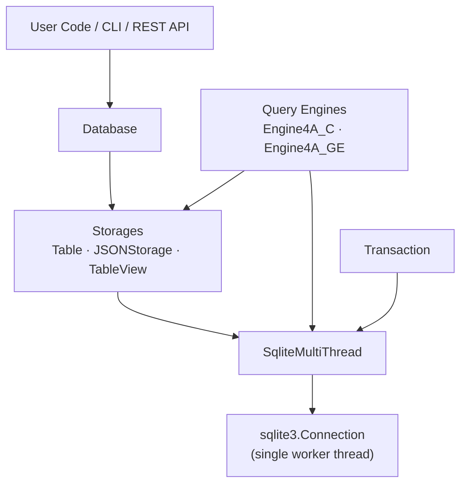
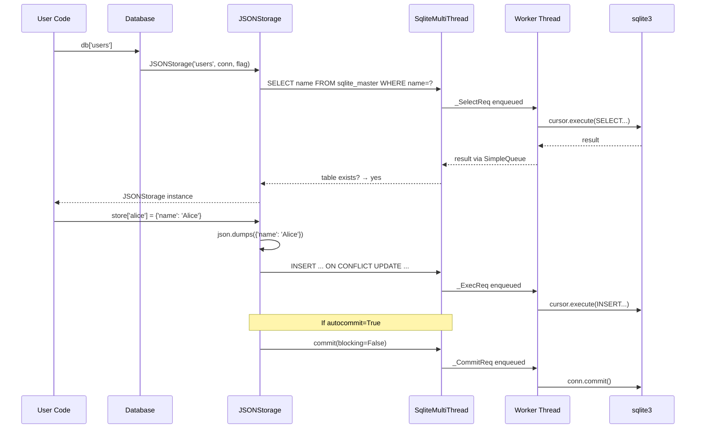

# DB86 — Complete Project Analysis

## 1. What is DB86?

DB86 is a **Python library** (v0.7.0, MIT licensed) that wraps SQLite3 to provide a **dict-like API** for database operations. Instead of writing raw SQL, you interact with databases the same way you would with a Python dictionary. It was inspired by [sqlitedict](https://github.com/RaRe-Technologies/sqlitedict) but extends the concept significantly with structured tables, JSON document storage, a query engine, a REST API, and CLI shells.

**In one sentence:** DB86 lets you treat a SQLite database like a Python `dict` while hiding all the SQL, threading, and connection-management complexity.

---

## 2. Project Structure

```
db86/
├── pyproject.toml              # Poetry config, dependencies, CLI entry points
├── poetry.lock                 # Locked dependency versions
├── README.md                   # User documentation
├── LICENSE.md                  # MIT License
│
├── db86/                       # Main package
│   ├── __init__.py             # Exports: Database, Transaction
│   ├── threads.py              # Thread-safe SQLite connection (core engine)
│   ├── database.py             # High-level Database class (UserDict)
│   ├── transaction.py          # Transaction & savepoint management
│   ├── storages.py             # Table, JSONStorage, TableView connectors
│   ├── engines.py              # Declarative query engines (Engine4A_C, Engine4A_GE)
│   ├── logger.py               # Package-level logger
│   ├── shell.py                # Local CLI shell (db86-shell)
│   ├── rest_shell.py           # REST client CLI shell (db86-restx)
│   └── service/
│       ├── __init__.py         # Exports: rest_app
│       └── rest_service.py     # FastAPI REST service + daemon CLI (db86-server)
│
└── tests/                      # Test suite (pytest)
    ├── test_core.py            # SqliteMultiThread unit tests
    ├── test_database.py        # Database class tests
    ├── test_table.py           # Table storage tests
    ├── test_jsonstorage.py     # JSONStorage tests
    ├── test_engines.py         # Query engine tests
    ├── test_rest_service.py    # REST API endpoint tests
    ├── test_rest_shell.py      # REST shell tests
    └── test_perf.py            # Performance & stress benchmarks
```

---

## 3. Architecture — Layer by Layer

The project is built in clean, well-separated layers. Here's how they stack:



### Layer 1: `threads.py` — The Foundation

This is the **most critical** module. It implements `SqliteMultiThread`, a class that:

- Spawns a **single daemon background thread** that holds the sole `sqlite3.Connection`
- Accepts work via a `SimpleQueue` of request dataclasses (`_ExecReq`, `_SelectReq`, `_ManyReq`, `_CommitReq`, `_CloseReq`)
- Serialises all SQLite operations through that one thread, making the entire library **thread-safe** without relying on `check_same_thread=False`

**Why this matters:** Python's `sqlite3` module is not thread-safe by default. DB86 solves this by funnelling *all* operations through a single worker thread, while multiple application threads can call methods concurrently.

```
Calling Thread A ──┐
                   │
Calling Thread B ──┼──→  SimpleQueue  ──→  Worker Thread  ──→  SQLite
                   │
Calling Thread C ──┘
```

**Key methods:**
| Method | Blocking? | Purpose |
|--------|-----------|---------|
| `execute(sql, args)` | Non-blocking (fire & forget) | Run INSERT/UPDATE/DELETE |
| `select(sql, args)` | Blocking | Fetch all rows |
| `select_one(sql, args)` | Blocking | Fetch one row |
| `executemany(sql, items)` | Blocking | Batch execute |
| `commit(blocking)` | Configurable | Persist to disk |
| `close(force)` | Configurable | Shutdown worker |

### Layer 2: `database.py` — The Public Interface

`Database` extends `UserDict` and acts as the main entry point users interact with. It:

- Opens/creates a SQLite database file
- Configures flags (`c` = create, `r` = read-only, `w` = wipe-and-create)
- Sets journal mode (DELETE, WAL, OFF)
- Provides dict-like access to **storages** (tables):

```python
db = Database('./my.db', autocommit=True, journal_mode='WAL')
json_store = db['users']              # → JSONStorage
table      = db['products', 'table']  # → Table
json_store2 = db['config', 'json']    # → JSONStorage (explicit)
```

- Exposes metadata properties: `storages`, `indices`, `views`
- Context manager support (`with Database(...) as db:`)

### Layer 3: `storages.py` — The Storage Connectors

Three classes that provide dict-like wrappers around SQLite tables:

#### `Table` — Structured/Relational Data
- Maps to a standard SQLite table with named columns
- Auto-creates with a `key` (PK) + `col1` column if table doesn't exist
- Supports rich access patterns:
  - `table['alice']` — row by primary key
  - `table[0]` — row by rowid offset
  - `table[1:5]` — row slice
  - `table['name']` — entire column
  - `table['alice', 'name', 'email']` — specific columns for a key
  - `table['city', 'NYC']` — filter by column value
- Schema operations: `add_column`, `drop_column`, `rename_column`, `add_foreign_key`, `add_index`

#### `JSONStorage` — Document/NoSQL Data
- Uses a two-column table: `key TEXT PRIMARY KEY, object TEXT`
- Values are JSON-serialised dicts stored as text blobs
- Supports **path queries** with wildcards:
  - `store['alice/address/city']` — nested path access
  - `store.get_path('*/name')` — wildcard path queries across all keys
  - `store.set_path('alice/address/city', 'NYC')` — nested writes
- Has a full **declarative query engine** (`query()` method) supporting:
  - `filter` (eq, ne, gt, lt, contains, startswith, in, not_in, and/or/not)
  - `select` (project specific paths)
  - `aggregate` (count, sum, avg, min, max with groupBy)
  - `sort`, `limit`, `offset`

#### `TableView` — Read-only View Wrapper
- Wraps a SQLite `CREATE VIEW`
- Read-only access by slice, index, column name, or filter tuple
- Can auto-create a view from a SQL SELECT statement

### Layer 4: `engines.py` — Query Engines

Two declarative query engines that compile "recipe" dicts into SQL:

#### `Engine4A_C` (single-table)
- Compiles filter expressions into `WHERE` clauses
- Handles aggregation, sorting, pagination at the SQL level
- Supports both `Table` (direct column references) and `JSONStorage` (`json_extract` paths)
- Uses parameterised queries to prevent SQL injection

#### `Engine4A_GE` (multi-table / global)
- Operates across **multiple tables** in a database
- Uses table names as prefixes in path expressions (e.g., `users.name`, `orders.total`)
- Supports parallel filter compilation via `ThreadPoolExecutor`
- Performs JOIN-like operations by collecting results from multiple storages

### Layer 5: `transaction.py` — Transaction Management

`Transaction` provides ACID guarantees through:
- `BEGIN` / `COMMIT` / `ROLLBACK` lifecycle
- Named **savepoints** for partial rollback
- Lock-retry logic (retries with delay when database is locked)
- Context manager: auto-commits on success, auto-rolls-back on exception

```python
with Transaction('my_tx', db.conn) as tx:
    db['users']['alice'] = {'name': 'Alice'}
    tx.savepoint('sp1')
    db['users']['bob'] = {'name': 'Bob'}
    tx.rollback_to('sp1')  # undoes Bob
    # Alice is committed when `with` block exits
```

### Layer 6: CLI Shells

#### `shell.py` → `db86-shell`
Interactive local management shell (uses `click-shell`):
- `create` / `close` databases
- `ls` — navigate `db/storage/items` like a filesystem
- `get` / `put-item` / `delete-item` — CRUD operations
- `storages` / `info` — introspect metadata

#### `rest_shell.py` → `db86-restx`
Interactive REST client shell:
- Same command structure as the local shell
- Communicates via HTTP to a running `db86-server`
- Supports `--base-url` to point to any DB86 REST service

### Layer 7: REST Service

#### `service/rest_service.py` → `db86-server`
Full **FastAPI** application with:

| Endpoint | Method | Description |
|----------|--------|-------------|
| `/` | GET | Health check + uptime + system metrics |
| `/databases` | GET/POST | List / create databases |
| `/databases/{name}` | GET/DELETE | Metadata / delete database |
| `/databases/{name}/close` | POST | Close database |
| `/databases/{name}/storages` | GET/POST | List / create storages |
| `/databases/{name}/storages/{storage}` | GET/DELETE | Metadata / delete storage |
| `.../items` | GET/POST | List / bulk upsert items |
| `.../items/{key}` | GET/PUT/DELETE | CRUD single item |
| `.../storages/{storage}/{query}` | GET | JSON path query |

Also includes a **daemon manager** CLI (`start`, `stop`, `restart`, `status`) using `daemonocle` for background service management.

---

## 4. Data Flow Example

Here's what happens when you write `db['users']['alice'] = {'name': 'Alice'}`:



---

## 5. Key Design Decisions

| Decision | Rationale |
|----------|-----------|
| **Single worker thread** | Avoids `check_same_thread=False` pitfalls; guarantees serialised writes |
| **`SimpleQueue` messaging** | Lock-free, thread-safe, simple producer/consumer pattern |
| **`UserDict` inheritance** | Storage classes feel like native Python dicts |
| **JSON blobs in TEXT columns** | Flexible schema-less storage; uses `json_extract()` for SQL-level queries |
| **Dataclass-based requests** | Clean, typed, self-documenting internal protocol for thread communication |
| **Non-blocking writes + blocking reads** | Writes can be fire-and-forget for performance; reads must wait for data |

---

## 6. Dependencies

| Package | Purpose |
|---------|---------|
| `click-shell` | Interactive CLI shell framework |
| `fastapi` | REST API framework |
| `uvicorn` | ASGI server for FastAPI |
| `tabulate` | Pretty-print table schemas |
| `asyncclick` | Async Click support (REST shell) |
| `daemonocle` | Unix daemon management for server |
| `psutil` | System metrics in health endpoint (runtime) |

**Dev dependencies:** `pytest`, `httpx` (test client), `lark` (parser toolkit — possibly for future query DSL)

---

## 7. Test Suite

8 test files covering all major modules:

| File | What it tests | Markers |
|------|---------------|---------|
| `test_core.py` | `SqliteMultiThread` low-level ops | `unit` |
| `test_database.py` | `Database` lifecycle, flags, context manager | `unit` |
| `test_table.py` | `Table` CRUD, columns, slicing, indices | `unit` |
| `test_jsonstorage.py` | `JSONStorage` CRUD, paths, queries | `unit` |
| `test_engines.py` | `Engine4A_C` and `Engine4A_GE` query compilation | `engine` |
| `test_rest_service.py` | FastAPI endpoints via `httpx` test client | — |
| `test_rest_shell.py` | REST shell command parsing | — |
| `test_perf.py` | Performance benchmarks & stress tests | `stress`, `performance`, `slow` |

---

## 8. Potential Improvements

### High Priority

| Area | Improvement | Details |
|------|-------------|---------|
| 🔒 **SQL Injection** | Parameterise table/column names | Several places use f-string formatting for table and column names (e.g., `f'SELECT * FROM "{self.name}"'`). While double-quote escaping is applied, parameterised identifiers or a whitelist would be safer. |
| ⚡ **Connection Pooling** | Add connection reuse for REST service | The REST service creates a new `Database` per request session. A connection pool would improve throughput under load. |
| 🧪 **Test Coverage** | Add `Transaction` and `TableView` tests | These two classes have no dedicated test files. Add `test_transaction.py` and `test_tableview.py`. |
| 📝 **Type Annotations** | Add consistent type hints | Many methods lack return type annotations and parameter types. Adding `py.typed` marker and full typing would improve IDE support. |

### Medium Priority

| Area | Improvement | Details |
|------|-------------|---------|
| 🔄 **Async Support** | Add async variants of storage methods | The REST service is built on FastAPI (async) but all DB operations are synchronous and block the event loop. Use `asyncio.to_thread()` or a true async SQLite driver. |
| 📊 **Query Language** | Formalize the query DSL | The `lark` dev dependency suggests a query language parser was planned. A mini-DSL (e.g., `"users WHERE age > 25 SELECT name, email ORDER BY name"`) would be a powerful feature. |
| 🏗 **Migration Support** | Schema migration tooling | Adding/dropping columns is supported, but there's no versioned migration system. A simple `migrations/` folder approach would help. |
| 🔍 **Indexing** | Auto-index frequently queried JSON paths | `JSONStorage.query()` does full table scans. Generated expression indices on common `json_extract()` paths would speed up queries. |
| 📦 **Batch Operations** | `executemany` for bulk JSON inserts | `JSONStorage` inserts one row at a time. A `bulk_insert(items: dict)` method using `executemany` would be significantly faster for large imports. |

### Low Priority / Nice-to-Have

| Area | Improvement | Details |
|------|-------------|---------|
| 🪵 **Structured Logging** | Replace print-style logging | Use structured logging (e.g., `structlog`) for better observability in production REST deployments. |
| 🔐 **Authentication** | Add REST API auth | The REST service has no authentication. Add API key or JWT middleware for production use. |
| 📄 **Pagination** | Cursor-based pagination | The REST service uses offset-based pagination, which degrades for large datasets. Cursor/keyset pagination would be more scalable. |
| 🧹 **Code Cleanup** | `Table.__setitem__` refactor | The method has complex branching for tuple vs dict values. Extract into `_insert_tuple()` and `_upsert_dict()` for clarity. |
| ⚠️ **Error Handling** | Custom exception hierarchy | Currently uses `RuntimeError`, `KeyError`, `TypeError` generically. A `db86.exceptions` module with `DB86Error`, `ReadOnlyError`, `StorageNotFoundError`, etc. would improve error handling. |
| 🖥 **Windows Compatibility** | Remove `os.getuid()`/`os.getgid()` | The `daemonocle` daemon in `rest_service.py` calls `os.getuid()` which doesn't exist on Windows. This crashes the `db86-server start` command on Windows. |

---

## 9. Summary

DB86 is a well-architected library that elegantly bridges the gap between Python's dict API and SQLite's relational engine. Its key strength is the **thread-safe single-worker design** in `threads.py`, which provides a solid foundation for everything else. The layered architecture — from raw SQL execution through storage connectors, query engines, and up to REST/CLI interfaces — gives users flexibility to interact at whatever level they need.

The project is at **Beta maturity** (v0.7.0) with good test coverage on core modules and a comprehensive feature set. The main areas for growth are async support, security hardening (especially for the REST service), and performance optimisation for large-scale JSON storage queries.
